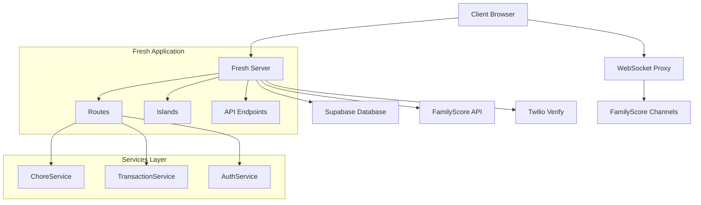

# ChoreGami 2026 Technical Documentation
**Version**: 1.0  
**Date**: January 6, 2026  
**Status**: ✅ Production Ready

## 🏗 System Architecture

### Overview
ChoreGami 2026 is built using a modern, scalable architecture combining server-side rendering with selective client-side hydration for optimal performance and user experience.



### Technology Stack

#### Frontend
- **Framework**: [Deno Fresh 1.7.2](https://fresh.deno.dev/) - Server-side rendering with Islands architecture
- **Runtime**: [Deno 2.0+](https://deno.land/) - Secure, modern JavaScript/TypeScript runtime
- **Styling**: Custom CSS with CSS Variables for theming
- **State Management**: Preact hooks for client-side interactivity
- **Real-time**: WebSocket connections for live updates

#### Backend
- **Server**: Fresh built-in server with file-based routing
- **Database**: [Supabase](https://supabase.io/) PostgreSQL with real-time subscriptions
- **Authentication**: Multi-provider OAuth with Supabase Auth
- **API Integration**: RESTful APIs with WebSocket proxy pattern
- **Security**: bcrypt for PIN hashing, cookie-based sessions, complete URL GUID elimination

#### External Services
- **FamilyScore**: Real-time point tracking and family gamification with sync endpoints
- **Twilio Verify**: Phone number authentication and SMS verification
- **Supabase**: Database, authentication, and real-time subscriptions

**See**: [FamilyScore Sync Integration Guide](familyscore-sync-integration.md) for detailed sync implementation

## 📁 Project Structure

```
/Users/georgekariuki/repos/deno2/chores2026/
├── 📄 README.md                 # Project overview and quick start
├── 📄 CLAUDE.md                 # Comprehensive project specifications
├── 📄 deno.json                 # Deno configuration and dependencies
├── 📄 fresh.config.ts           # Fresh framework configuration
├── 📄 main.ts                   # Production entry point
├── 📄 dev.ts                    # Development entry point
├── 📁 routes/                   # File-based routing (Fresh)
│   ├── 📄 _app.tsx              # Application layout and global providers
│   ├── 📄 index.tsx             # Landing page with family selector
│   ├── 📄 login.tsx             # Authentication page
│   ├── 📁 kid/                  # Kid-focused routes
│   │   └── 📁 [kid_id]/         # Dynamic kid-specific routes
│   │       ├── 📄 dashboard.tsx # Kid dashboard with today's chores
│   │       └── 📁 chore/        # Individual chore management
│   │           └── 📄 [chore_id].tsx # Chore detail and completion
│   ├── 📁 parent/               # Parent dashboard routes
│   │   └── 📁 [family_id]/      
│   │       └── 📄 dashboard.tsx # Parent family management dashboard
│   └── 📁 api/                  # REST API endpoints
│       ├── 📁 chores/           # Chore-related API routes
│       ├── 📁 family/           # Family settings API
│       ├── 📁 pin/              # PIN verification API
│       ├── 📁 points/           # Point management API
│       └── 📁 familyscore/      # WebSocket proxy routes
├── 📁 islands/                  # Client-side interactive components
│   ├── 📄 KidSelector.tsx       # Family member selection grid
│   ├── 📄 PinEntryModal.tsx     # 4-digit PIN authentication
│   ├── 📄 KidDashboard.tsx      # Kid's main dashboard with event grouping
│   ├── 📄 ChoreList.tsx         # Chore listing with showPoints prop
│   ├── 📄 ChoreDetail.tsx       # Individual chore interface
│   ├── 📄 EventMissionGroup.tsx # Event-linked chores display
│   ├── 📄 EventsList.tsx        # Parent events list
│   ├── 📄 AddEventModal.tsx     # Event creation form
│   ├── 📄 LiveLeaderboard.tsx   # Real-time family rankings
│   ├── 📄 LiveActivityFeed.tsx  # Recent activity stream
│   ├── 📄 ParentDashboard.tsx   # Parent management interface
│   ├── 📄 AddChoreModal.tsx     # Chore creation with event linking
│   └── 📁 auth/                 # Authentication components
├── 📁 lib/                      # Core business logic
│   ├── 📁 services/             # Data access and business services
│   │   ├── 📄 chore-service.ts  # Chore CRUD operations with event support
│   │   └── 📄 transaction-service.ts # Point tracking with FamilyScore
│   ├── 📁 utils/                # Utility functions
│   │   └── 📄 household.ts      # Event grouping (Today/This Week/Later), points mode detection
│   ├── 📁 auth/                 # Authentication system
│   ├── 📁 security/             # Security utilities
│   └── 📁 user-state/           # Session management
├── 📁 static/                   # Static assets
│   ├── 📄 styles.css            # Global styles and Fresh Meadow theme
│   └── 📁 *.js                  # Client-side authentication helpers
├── 📁 utils/                    # Utility functions
└── 📁 docs/                     # Comprehensive documentation
    ├── 📄 index.md              # Documentation table of contents
    ├── 📄 business-requirements.md # Product specifications
    ├── 📄 technical-documentation.md # This file
    ├── 📄 familyscore-sync-integration.md # FamilyScore sync guide
    └── 📁 milestones/           # Implementation tracking
```

## 🔧 Core Services

### ChoreService (`/lib/services/chore-service.ts`)

**Purpose**: Manages all chore-related operations including CRUD operations, family management, and PIN authentication.

#### Key Methods

```typescript
class ChoreService {
  // Family Management
  getFamily(familyId: string): Promise<Family | null>
  getFamilyMembers(familyId: string): Promise<FamilyProfile[]>
  updateFamilyPinSetting(familyId: string, enabled: boolean): Promise<boolean>

  // Chore Operations
  getTodaysChores(profileId: string, familyId: string): Promise<ChoreAssignment[]>
  getChoreAssignment(choreId: string, familyId: string): Promise<ChoreAssignment | null>
  completeChore(choreId: string, profileId: string, familyId: string): Promise<ChoreResult>
  
  // PIN Management
  setKidPin(kidId: string, pinHash: string): Promise<boolean>
  getKidPin(kidId: string): Promise<string | null>

  // Note: Point management handled by TransactionService
}
```

#### Database Schema Integration

**Utilized Tables:**
- `families` - Family information and settings
- `family_profiles` - Family members with roles and points
- `chore_templates` - Reusable chore definitions
- `chore_assignments` - Individual task assignments
- `chore_transactions` - Point transaction history

**New Schema Additions:**
```sql
-- Added to existing families table
ALTER TABLE families ADD COLUMN children_pins_enabled BOOLEAN DEFAULT false;

-- Utilized existing pin_hash column in family_profiles
-- No additional tables required
```

### TransactionService (`/lib/services/transaction-service.ts`)

**Purpose**: Production-tested transaction ledger system that records all point changes and syncs with FamilyScore in real-time.

#### Key Features

```typescript
class TransactionService {
  // Core Transaction Recording
  recordChoreCompletion(choreId: string, points: number, choreName: string, 
                       profileId: string, familyId: string): Promise<void>
  
  // Administrative Adjustments
  recordPointAdjustment(adjustmentId: string, pointsChange: number, reason: string,
                       profileId: string, familyId: string): Promise<void>
  
  // Bonus and Corrections
  recordBonusAward(profileId: string, points: number, bonusType: string, 
                  familyId: string): Promise<void>
  
  // Private: FamilyScore Integration
  private notifyFamilyScore(request: TransactionRequest, newBalance: number): Promise<void>
  private generateTransactionFingerprint(data: TransactionHashData): Promise<string>
}
```

#### Transaction Flow

1. **Local Transaction**: Record in `chore_transactions` table
2. **Balance Update**: Update `family_profiles.current_points`
3. **FamilyScore Sync**: POST to FamilyScore API with transaction hash
4. **WebSocket Broadcast**: Real-time update to connected family members
5. **Error Handling**: Graceful fallback if FamilyScore unavailable

**See**: [FamilyScore Sync Integration Guide](familyscore-sync-integration.md) for comprehensive sync documentation

#### Security Features

- **Transaction Fingerprinting**: SHA-256 hash for audit trails
- **Idempotency**: Prevents duplicate transactions
- **Audit Trail**: Complete history of all point changes
- **Error Isolation**: FamilyScore failures don't affect core functionality

## 🌐 API Architecture

### REST Endpoints

#### Chore Management
```typescript
// Complete a chore assignment
POST /api/chores/[chore_id]/complete
Body: { kid_id: string }
Response: { success: boolean, chore: ChoreAssignment, points_earned: number }

// Get chore details
GET /kid/[kid_id]/chore/[chore_id]
Response: ChoreDetailPage with instructions and completion interface
```

#### Family Management
```typescript
// Toggle PIN requirement for children
POST /api/family/[family_id]/pin-setting
Body: { children_pins_enabled: boolean }
Response: { success: boolean, children_pins_enabled: boolean }

// Adjust member points (parents only)
POST /api/points/adjust
Body: { member_id: string, family_id: string, amount: number, reason: string }
Response: { success: boolean, new_balance: number }
```

#### Events Calendar
```typescript
// List family events (today and future)
GET /api/events
Response: { events: FamilyEvent[] }

// Create a new event
POST /api/events
Body: { title: string, emoji?: string, event_date: string, event_time?: string,
        is_all_day?: boolean, participants?: string[] }
Response: { event: FamilyEvent }

// Get single event
GET /api/events/[id]
Response: { event: FamilyEvent }

// Delete event (soft delete, unlinks chores)
DELETE /api/events/[id]
Response: { success: boolean }

// Create chore with event link (supports one-time and recurring)
POST /api/chores/create
Body: { name: string, points: number, assignedTo: string, dueDate: string,
        familyEventId?: string, isRecurring?: boolean, recurringDays?: string[] }
Response: { success: boolean, choreId?: string, templateId?: string, isRecurring: boolean }
```

#### Manual Mode Chore Management
```typescript
// Get existing manual chores (recurring templates + one-time assignments)
GET /api/chores/recurring
Response: {
  success: boolean,
  recurring: Array<{ id, type: 'recurring', name, points, recurring_days, assigned_to_profile_id, assigned_to_name }>,
  oneTime: Array<{ id, type: 'one_time', name, points, due_date, assigned_to_profile_id, assigned_to_name }>,
  templates: []  // Deprecated, kept for backwards compat
}

// Edit a chore (recurring template or one-time assignment)
POST /api/chores/[chore_id]/edit
Body: { type: 'recurring' | 'one_time', name?, points?, assignedTo?, recurringDays?, dueDate? }
Response: { success: boolean, message: string }

// Soft-delete a chore (recurring template or one-time assignment)
POST /api/chores/[chore_id]/delete
Body: { type: 'recurring' | 'one_time' }
Response: { success: boolean, message: string }
```

**Kid Event Creation** ✅ **Implemented Jan 20, 2026**

Kids can create events when `families.settings.apps.choregami.kids_can_create_events` is enabled.
- **API**: `POST /api/events` accepts `creatorId` for kid attribution
- **Settings API**: `POST /api/settings/kids-events` toggles the family setting
- **PIN Gating**: If kid PINs enabled, PIN required before creating
- **Attribution**: `created_by_profile_id` stores kid's profile ID
- **Parent Visibility**: Events show "Added by [name]" badge in events list
- See [Implementation Details](./milestones/20260120_kid_event_creation.md)

#### Authentication
```typescript
// Verify or setup kid PIN
POST /api/pin/verify
Body: { kid_id: string, pin: string, setup_mode?: boolean }
Response: { success: boolean, verified?: boolean, hash?: string }
```

### WebSocket Integration

#### Real-time Proxy (`/api/familyscore/live/[family_id]`)

**Architecture**: Server-side WebSocket proxy that securely connects to FamilyScore Phoenix Channels while protecting API credentials.

```typescript
// Client Connection Flow
const ws = new WebSocket(`wss://localhost:8001/api/familyscore/live/${familyId}`);

// Server Proxy Implementation
export const handler: Handlers = {
  GET(req, ctx) {
    const { socket, response } = Deno.upgradeWebSocket(req);
    
    // Connect to FamilyScore Phoenix Channel
    const familyScoreSocket = new WebSocket(
      `${familyScoreWsUrl}/socket/websocket?vsn=2.0.0`
    );
    
    // Proxy messages between client and FamilyScore
    familyScoreSocket.onmessage = (event) => {
      const transformedData = transformFamilyScoreMessage(event.data);
      socket.send(JSON.stringify(transformedData));
    };
    
    return response;
  }
};
```

#### Message Format

**FamilyScore → Client Transformation:**
```typescript
// FamilyScore Event
{
  event: "point_update",
  payload: {
    user_id: "user_123",
    user_name: "Emma",
    points: 50,
    chore_name: "Take out trash"
  }
}

// Transformed for Client
{
  type: "chore_completed",
  familyId: "family_456",
  userId: "user_123",
  userName: "Emma",
  points: 50,
  choreName: "Take out trash",
  timestamp: "2026-01-06T10:30:00.000Z"
}
```

## 🎨 Frontend Architecture

### Islands Architecture (Fresh)

**Concept**: Server-side rendering with selective client-side hydration for optimal performance.

```typescript
// Server-Rendered Route (/routes/kid/[kid_id]/dashboard.tsx)
export default function KidDashboard({ data }: PageProps<DashboardData>) {
  return (
    <div class="container">
      <div class="header">Kid Dashboard</div>
      
      {/* Server-rendered static content */}
      <div class="stats">{data.completedToday} chores completed</div>
      
      {/* Client-side interactive island */}
      <ChoreList chores={data.todaysChores} kidId={data.kid.id} />
      <LiveLeaderboard familyMembers={data.familyMembers} />
    </div>
  );
}

// Interactive Island (/islands/ChoreList.tsx)
export default function ChoreList({ chores, kidId }: Props) {
  const [completingChore, setCompletingChore] = useState<string | null>(null);
  
  const handleComplete = async (choreId: string) => {
    // Client-side interaction logic
  };
  
  return (
    // Interactive component with state and event handlers
  );
}
```

### State Management Strategy

**Server State**: Fetched during SSR and passed to islands as props
**Client State**: Managed with Preact hooks for interactivity
**Real-time State**: Updated via WebSocket messages and local state

```typescript
// Real-time State Updates
useEffect(() => {
  const ws = new WebSocket(`/api/familyscore/live/${familyId}`);
  
  ws.onmessage = (event) => {
    const data = JSON.parse(event.data);
    
    if (data.type === "leaderboard_update") {
      setLeaderboard(data.leaderboard);
    }
    
    if (data.type === "chore_completed") {
      setActivities(prev => [data, ...prev.slice(0, 9)]);
    }
  };
  
  return () => ws.close();
}, [familyId]);
```

### Component Hierarchy

```
App Layout (_app.tsx)
├── Authentication Provider
├── Theme Provider
└── Route Components
    ├── Kid Dashboard
    │   ├── Header (static)
    │   ├── Stats Summary (static)
    │   ├── ChoreList (island)
    │   └── LiveLeaderboard (island)
    ├── Parent Dashboard
    │   ├── Family Overview (static)
    │   ├── ParentDashboard (island)
    │   ├── LiveActivityFeed (island)
    │   └── Point Adjustment Modal (island)
    └── Chore Detail
        ├── Instructions (static)
        └── ChoreDetail (island)
```

## 🔐 Security Architecture

### Authentication System

#### Multi-Provider Support
```typescript
interface AuthProvider {
  email: EmailPasswordAuth;
  phone: TwilioVerifyAuth;
  social: {
    google: GoogleOAuth;
    apple: AppleOAuth;
    facebook: FacebookOAuth;
  };
}
```

#### Session Management
- **Server-side Sessions**: Supabase JWT tokens with refresh rotation
- **Client-side Storage**: Secure localStorage with encryption
- **Cross-device Sync**: Session validation across multiple devices
- **Timeout Handling**: Automatic logout after inactivity

### PIN Security System

#### Implementation
```typescript
// PIN Hashing (bcrypt with salt rounds)
const hashedPin = await bcrypt.hash(pin, 10);

// PIN Verification
const isValid = await bcrypt.compare(enteredPin, storedHash);

// Storage Strategy
localStorage.setItem(`kid_pin_${kidId}`, hashedPin); // Local cache
await choreService.setKidPin(kidId, hashedPin);      // Database backup
```

#### Security Features
- **Local First**: PIN cached locally for instant access
- **Database Backup**: Cross-device PIN sync capability
- **Encryption**: bcrypt with configurable salt rounds
- **Attempt Limiting**: Future enhancement for brute force protection

### API Security

#### WebSocket Proxy Pattern
```typescript
// Client → Server WebSocket (secure)
const clientWs = new WebSocket(`wss://app.domain.com/api/familyscore/live/${familyId}`);

// Server → FamilyScore (with API key)
const familyScoreWs = new WebSocket(`wss://familyscore.com/socket/websocket`, {
  headers: { 'Authorization': `Bearer ${FAMILYSCORE_API_KEY}` }
});
```

**Benefits:**
- API keys never exposed to client
- Rate limiting at proxy level
- Message transformation and validation
- Connection pooling and management

#### Input Validation
```typescript
// Parameter Sanitization
function sanitizeInput(input: unknown): string {
  return String(input).trim().slice(0, 1000);
}

// Request Validation
const validateChoreCompletion = (body: unknown) => {
  const { kid_id } = body as { kid_id?: string };
  if (!kid_id || typeof kid_id !== 'string') {
    throw new Error('Invalid kid_id parameter');
  }
  return kid_id;
};
```

## 🎯 Performance Optimization

### Server-Side Rendering (SSR)

**Strategy**: Render as much as possible on the server for fast initial page loads

```typescript
// Route Handler with Data Fetching
export const handler: Handlers<DashboardData> = {
  async GET(req, ctx) {
    const kidId = ctx.params.kid_id;
    
    // Parallel data fetching
    const [kid, family, todaysChores, familyMembers] = await Promise.all([
      choreService.getFamilyMember(kidId),
      choreService.getFamily(familyId),
      choreService.getTodaysChores(kidId, familyId),
      choreService.getFamilyMembers(familyId)
    ]);
    
    return ctx.render({
      kid,
      family,
      todaysChores,
      familyMembers,
      timestamp: Date.now()
    });
  }
};
```

### Client-Side Optimization

#### Bundle Size Optimization
- **Tree Shaking**: Only import used functions from libraries
- **Code Splitting**: Islands loaded independently
- **Preact**: Lightweight React alternative (3KB vs 42KB)

#### Runtime Performance
```typescript
// Debounced API Calls
const debouncedSearch = useMemo(
  () => debounce((query: string) => searchChores(query), 300),
  []
);

// Memoized Expensive Calculations
const sortedLeaderboard = useMemo(
  () => familyMembers.sort((a, b) => b.current_points - a.current_points),
  [familyMembers]
);

// Optimistic Updates
const handleChoreComplete = async (choreId: string) => {
  // Immediate UI update
  setChores(prev => prev.map(c => 
    c.id === choreId ? { ...c, status: 'completed' } : c
  ));
  
  // Background API call
  try {
    await completeChore(choreId);
  } catch (error) {
    // Revert on failure
    setChores(prev => prev.map(c => 
      c.id === choreId ? { ...c, status: 'pending' } : c
    ));
  }
};
```

### Database Performance

#### Query Optimization
```sql
-- Efficient Today's Chores Query
SELECT ca.*, ct.name, ct.description, ct.icon
FROM chore_assignments ca
JOIN chore_templates ct ON ca.chore_template_id = ct.id
WHERE ca.family_id = $1
  AND ca.assigned_to_profile_id = $2
  AND ca.assigned_date = CURRENT_DATE
  AND ca.is_deleted = false
ORDER BY ca.due_time ASC, ca.point_value DESC;

-- Optimized Family Leaderboard
SELECT fp.id, fp.name, fp.current_points, fp.role
FROM family_profiles fp
WHERE fp.family_id = $1
  AND fp.role = 'child'
ORDER BY fp.current_points DESC;
```

#### Caching Strategy
- **Supabase RLS**: Row-level security with automatic caching
- **Browser Cache**: Static assets cached with fingerprinting
- **Memory Cache**: Frequently accessed family data
- **Real-time**: WebSocket updates invalidate relevant caches

## 📱 Mobile Optimization

### Responsive Design System

#### Breakpoint Strategy
```css
/* Mobile First Approach */
.container {
  max-width: 400px;    /* Mobile optimization */
  margin: 0 auto;
  padding: 1rem;
}

@media (max-width: 480px) {
  .container {
    padding: 0.5rem;    /* Tighter spacing on small screens */
  }
  
  .btn {
    min-height: 44px;   /* iOS touch target minimum */
    font-size: 1.125rem; /* Larger text for readability */
  }
}

@media (min-width: 768px) {
  .container {
    max-width: 600px;   /* Tablet optimization */
  }
}
```

#### Touch-First Interactions
- **Minimum Touch Targets**: 44px minimum for accessibility
- **Gesture Support**: Swipe gestures for chore completion
- **Visual Feedback**: Immediate response to touch interactions
- **Error Prevention**: Confirmation dialogs for destructive actions

### Progressive Web App (PWA) Ready

#### Service Worker Preparation
```typescript
// Future PWA Implementation
const CACHE_NAME = 'choreGami-v1';
const urlsToCache = [
  '/',
  '/static/styles.css',
  '/static/offline.html'
];

self.addEventListener('install', (event) => {
  event.waitUntil(
    caches.open(CACHE_NAME)
      .then(cache => cache.addAll(urlsToCache))
  );
});
```

#### Manifest Configuration
```json
{
  "name": "ChoreGami 2026",
  "short_name": "ChoreGami",
  "description": "Family chore management with real-time gamification",
  "start_url": "/",
  "display": "standalone",
  "background_color": "#f0fdf4",
  "theme_color": "#10b981",
  "icons": [
    {
      "src": "/static/icons/icon-192.png",
      "sizes": "192x192",
      "type": "image/png"
    }
  ]
}
```

## 🚀 Deployment Architecture

### Production Configuration

#### Environment Variables
```env
# Required: Database Configuration
SUPABASE_URL=https://your-project.supabase.co
SUPABASE_ANON_KEY=your_anon_key
SUPABASE_SERVICE_ROLE_KEY=your_service_role_key

# Required: FamilyScore Integration
FAMILYSCORE_BASE_URL=https://api.familyscore.com
FAMILYSCORE_API_KEY=your_familyscore_api_key
FAMILYSCORE_WS_URL=wss://api.familyscore.com

# Optional: Authentication Providers
TWILIO_ACCOUNT_SID=your_twilio_account_sid
TWILIO_AUTH_TOKEN=your_twilio_auth_token
TWILIO_VERIFY_SERVICE_SID=your_verify_service_sid

# Optional: Monitoring and Analytics
SENTRY_DSN=your_sentry_dsn
GOOGLE_ANALYTICS_ID=your_ga_id
```

#### Deployment Targets

**Deno Deploy (Primary)**
```typescript
// deno.json deployment configuration
{
  "tasks": {
    "start": "deno run -A main.ts",
    "build": "deno run -A dev.ts build",
    "preview": "deno run -A main.ts"
  },
  "deploy": {
    "project": "choreGami2026",
    "entrypoint": "./main.ts",
    "exclude": ["docs/", "*.md", ".git/"]
  }
}
```

**Docker (Alternative)**
```dockerfile
FROM denoland/deno:2.0.0

WORKDIR /app
COPY . .

RUN deno cache main.ts

EXPOSE 8000
CMD ["run", "-A", "main.ts"]
```

### Monitoring and Observability

#### Logging Strategy
```typescript
// Structured Logging
const logger = {
  info: (message: string, meta?: object) => {
    console.log(JSON.stringify({
      level: 'info',
      message,
      timestamp: new Date().toISOString(),
      ...meta
    }));
  },
  
  error: (message: string, error?: Error, meta?: object) => {
    console.error(JSON.stringify({
      level: 'error',
      message,
      error: error?.message,
      stack: error?.stack,
      timestamp: new Date().toISOString(),
      ...meta
    }));
  }
};
```

#### Health Checks
```typescript
// Health Check Endpoint
export const handler: Handlers = {
  async GET() {
    const health = {
      status: 'healthy',
      timestamp: new Date().toISOString(),
      services: {
        database: await checkSupabase(),
        familyScore: await checkFamilyScore(),
        websocket: await checkWebSocketProxy()
      }
    };
    
    const isHealthy = Object.values(health.services).every(s => s === 'healthy');
    
    return Response.json(health, {
      status: isHealthy ? 200 : 503
    });
  }
};
```

## 🧪 Testing Strategy

### Test Categories

#### Unit Tests (Planned)
```typescript
// Service Layer Testing
describe('ChoreService', () => {
  it('should complete chore and update points', async () => {
    const result = await choreService.completeChore('chore_123', 'kid_456', 'family_789');
    
    expect(result.success).toBe(true);
    expect(result.assignment?.status).toBe('completed');
  });
  
  it('should reject completion for wrong assignee', async () => {
    const result = await choreService.completeChore('chore_123', 'wrong_kid', 'family_789');
    
    expect(result.success).toBe(false);
    expect(result.error).toContain('not assigned');
  });
});
```

#### Integration Tests (Planned)
```typescript
// API Endpoint Testing
describe('Chore Completion API', () => {
  it('should complete chore via POST request', async () => {
    const response = await fetch('/api/chores/chore_123/complete', {
      method: 'POST',
      headers: { 'Content-Type': 'application/json' },
      body: JSON.stringify({ kid_id: 'kid_456' })
    });
    
    expect(response.status).toBe(200);
    
    const data = await response.json();
    expect(data.success).toBe(true);
    expect(data.points_earned).toBeGreaterThan(0);
  });
});
```

#### End-to-End Tests (Planned)
```typescript
// User Journey Testing with Playwright
describe('Kid Chore Completion Flow', () => {
  it('should allow kid to complete chore and see points', async () => {
    await page.goto('/kid/kid_456/dashboard');
    
    // Select chore
    await page.click('[data-testid="chore-item"]:first-child');
    
    // Complete chore
    await page.click('[data-testid="complete-button"]');
    
    // Verify celebration
    await expect(page.locator('[data-testid="celebration"]')).toBeVisible();
    
    // Verify points update
    await expect(page.locator('[data-testid="point-total"]')).toContainText('150');
  });
});
```

### Performance Testing

#### Load Testing Strategy
```typescript
// WebSocket Connection Testing
const loadTest = async () => {
  const connections = [];
  
  // Simulate 100 concurrent families
  for (let i = 0; i < 100; i++) {
    const ws = new WebSocket(`ws://localhost:8001/api/familyscore/live/family_${i}`);
    connections.push(ws);
  }
  
  // Measure connection times and memory usage
  console.log(`Connected ${connections.length} WebSocket clients`);
};
```

## 🔮 Technical Roadmap

### Immediate Enhancements (Q1 2026)

#### Performance Optimization
- **Bundle Analysis**: Identify and eliminate unnecessary dependencies
- **Image Optimization**: WebP format with lazy loading
- **Edge Caching**: CDN integration for static assets
- **Database Indexing**: Optimize frequently queried columns

#### Security Hardening ✅ **Implemented Jan 18, 2026**
- **Rate Limiting**: Deno KV-based middleware for auth endpoints (5 req/min login, 3 req/min register)
- **Enumeration Protection**: Generic error messages prevent email/phone discovery attacks
- **Honeypot Bot Detection**: Hidden form fields detect automated submissions (~70% simple bots)
- **See**: [Authentication Security Hardening](./milestones/20260118_authentication_security_hardening.md)

#### Template Gating & Gift Codes ✅ **Implemented Jan 19, 2026**
- **Plan Tiers**: Free (Manual, Daily Basics, Dynamic Daily) vs Family Plan (all advanced templates)
- **Prepaid Time Passes**: School Year ($49/300 days), Summer ($19/90 days), Full Year ($59/365 days)
- **Gift Code Redemption**: `/redeem` page with GIFT-XXXX-XXXX-XXXX codes
- **Plan Extension**: Redeeming codes adds days to existing plans (doesn't replace)
- **Component Extraction**: TemplateSelector (~450 lines) extracted from FamilySettings
- **Unit Tests**: 29 tests (15 plan-gate + 14 redemption)
- **See**: [Template Gating Implementation](./planned/20260118_template_gating_gift_codes.md)

#### Events Calendar Integration ✅ **Implemented Jan 19, 2026**
- **Event-Chore Linking**: Chores can be linked to family events via `family_event_id`
- **Mission Grouping**: Kid dashboard shows event-linked chores as grouped "missions"
- **Points Hiding**: Event missions hide points (focus on preparation, not rewards)
- **Parent Events Page**: `/parent/events` with "This Week" and "Upcoming" sections
- **Event Creation**: Simplified form with title, emoji, date, time, participants
- **Utility Functions**: `groupChoresByEvent()`, `usePointsMode()`, `formatEventDate()`, `groupEventsByTimePeriod()` (smart Today/This Week/Later grouping)
- **See**: [Events Calendar Implementation](./planned/20260119_events_calendar_rev2.md)

#### Future Security Enhancements
- **CSRF Protection**: Cross-site request forgery prevention
- **Content Security Policy**: XSS attack mitigation
- **Security Headers**: Comprehensive security header implementation

### Medium-term Goals (Q2 2026)

#### Scalability Improvements
- **Horizontal Scaling**: Multi-region deployment
- **Database Sharding**: Family-based data partitioning
- **Connection Pooling**: WebSocket connection optimization
- **Caching Layer**: Redis implementation for frequently accessed data

#### Feature Extensions
- **Offline Support**: Service worker and local storage
- **Push Notifications**: Web Push API integration
- **Voice Commands**: Web Speech API for accessibility
- **Advanced Analytics**: Custom metrics and dashboards

### Long-term Vision (Q3-Q4 2026)

#### Platform Evolution
- **Microservices**: Service decomposition for better scaling
- **Event Sourcing**: Audit trail and state reconstruction
- **Machine Learning**: Predictive chore assignment
- **IoT Integration**: Smart home device connectivity

#### Ecosystem Integration
- **Third-party APIs**: Calendar, reminder, and reward systems
- **White-label Platform**: Customizable deployment for schools
- **Enterprise Features**: Multi-tenant architecture
- **Advanced Analytics**: Business intelligence and reporting

---

**Document Maintained By**: Engineering Team
**Last Updated**: January 25, 2026
**Review Schedule**: Monthly technical review
**Version Control**: Git-based documentation versioning